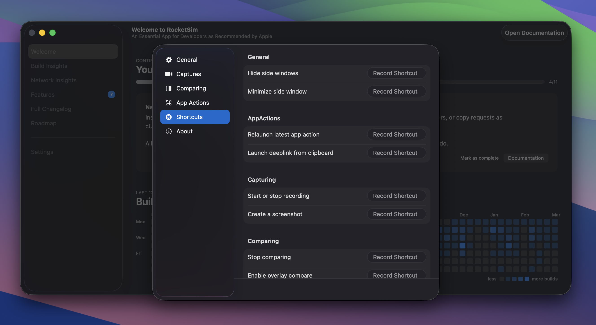

You can view and customize all shortcuts in **Settings → Shortcuts**:

RocketSim provides shortcuts in four groups:

**General** — Toggle the side window and control visibility.

**App Actions** — Quick access to app-related actions (e.g. relaunch, terminate).

**Capturing** — Take a screenshot, start or stop a recording, and related capture actions.

**Comparing** — Toggle design comparison and related comparison actions.

The exact key bindings and full list of 10 shortcuts are shown in **Settings → Shortcuts**; you can change them there to match your workflow.

If you're missing a shortcut, feel free to [open a feature request](https://github.com/AvdLee/RocketSimApp/issues). Shortcuts are relatively easy for me to add.
