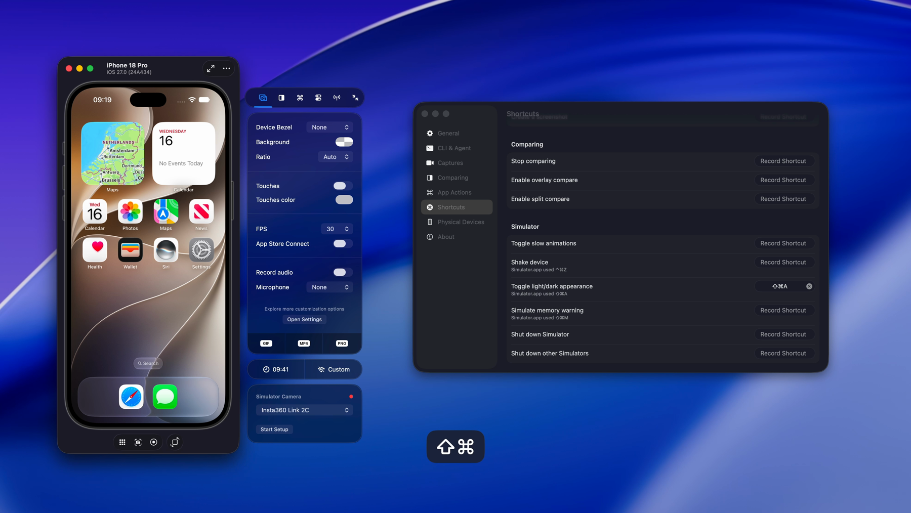

You can view and customize all shortcuts in **Settings → Shortcuts**:

RocketSim organizes shortcuts into the following groups:

**General** — Toggle the side window and control visibility.

**Simulator** — Toggle Slow Animations, Shake, change appearance, simulate a memory warning, or shut down Simulators.

**App Actions** — Quick access to app-related actions (e.g. relaunch, terminate).

**Capturing** — Take a screenshot, start or stop a recording, and related capture actions.

**Comparing** — Toggle design comparison and related comparison actions.

## Configure a shortcut

1. Open **RocketSim → Settings → Shortcuts**.
2. Select the group containing the action.
3. Select **Record Shortcut**.
4. Press the key combination you want to assign.

RocketSim shortcuts are global. They remain available while Xcode 27 Device Hub, Simulator.app, or your app is frontmost.

If your key combination matches a macOS menu item, RocketSim warns about the conflict. Menu items can take priority depending on the focused app, but the warning no longer permanently blocks you from choosing that shortcut.

## Device Hub Simulator shortcuts

RocketSim 16.5 adds a **Simulator** group for workflows that are missing from Device Hub:

- **Toggle slow animations**
- **Shake device**
- **Toggle light/dark appearance**
- **Simulate memory warning**
- **Shut down Simulator**
- **Shut down other Simulators**

These shortcuts are unassigned by default. RocketSim shows the combinations Simulator.app historically used as suggestions:

- Shake: <strong>⌃⌘Z</strong>
- Toggle Light/Dark Appearance: <strong>⇧⌘A</strong>
- Simulate Memory Warning: <strong>⇧⌘M</strong>

You can reuse these suggestions or choose combinations that fit your setup. Read [Simulator Actions](/docs/features/app-actions/simulator-actions/) for menu and Comparing-tab access, or [Slow Animations](/docs/features/design-comparison/slow-animations/) for speed controls.

## Missing a shortcut?

If an action is not available, feel free to [open a feature request](https://github.com/AvdLee/RocketSimApp/issues). Shortcuts are relatively easy for me to add.
