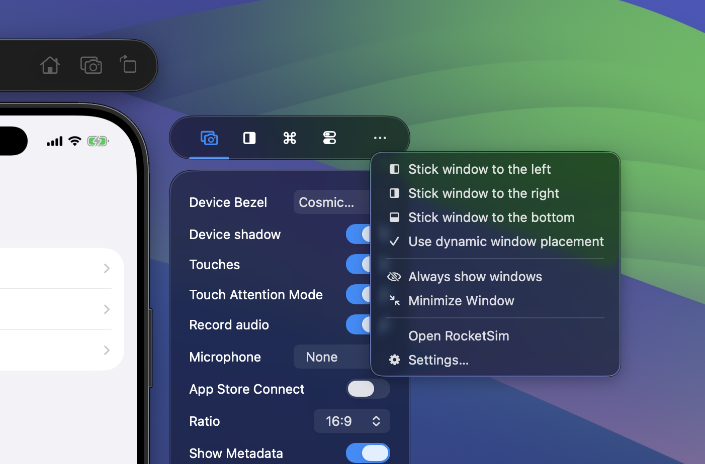
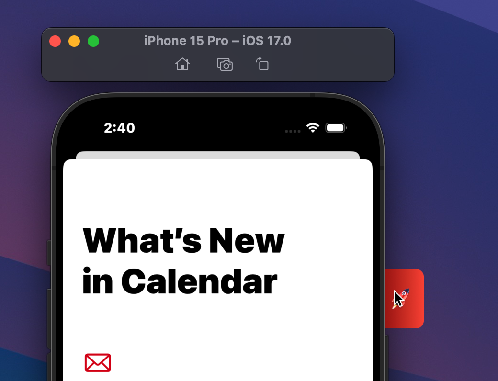
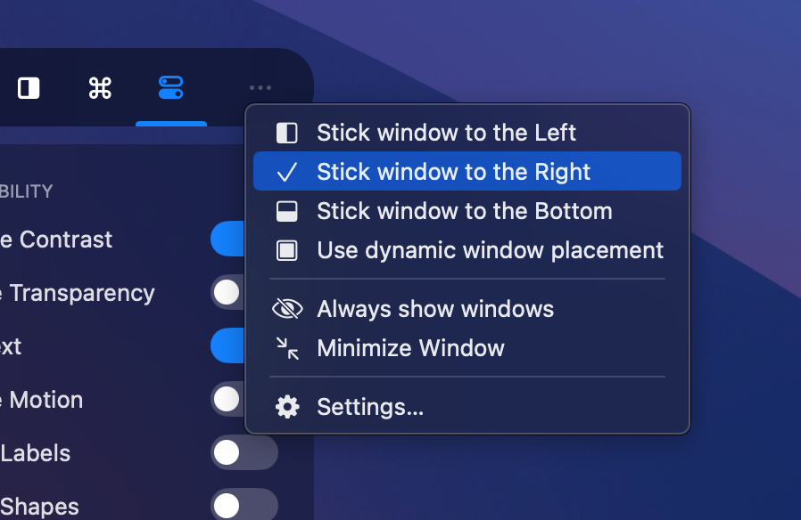
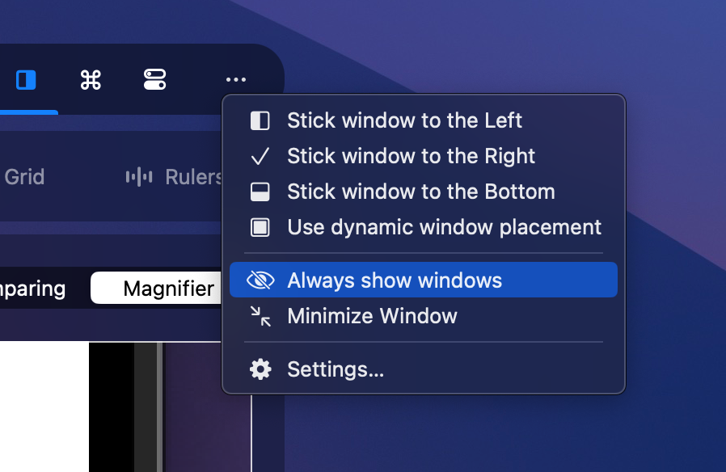
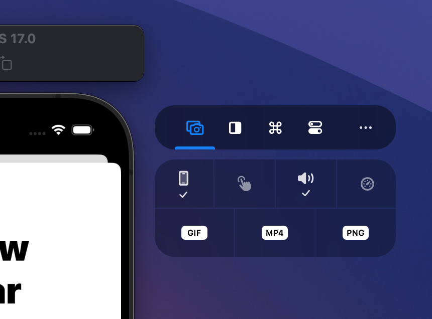
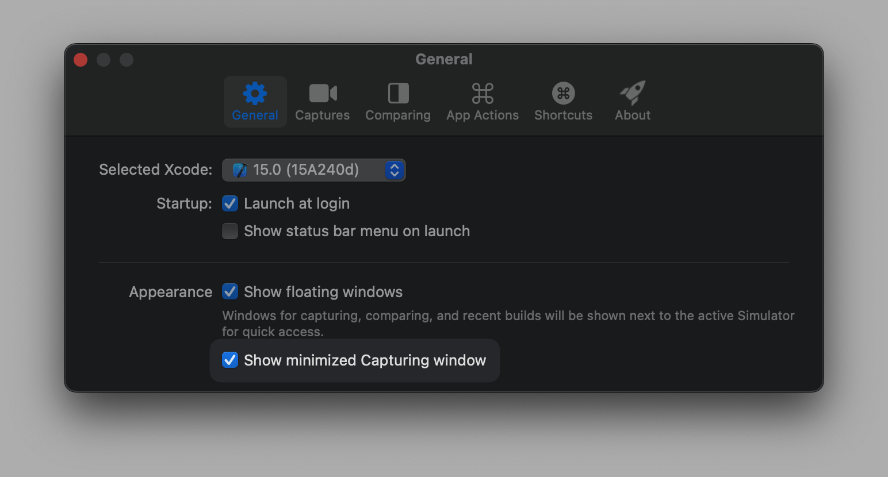
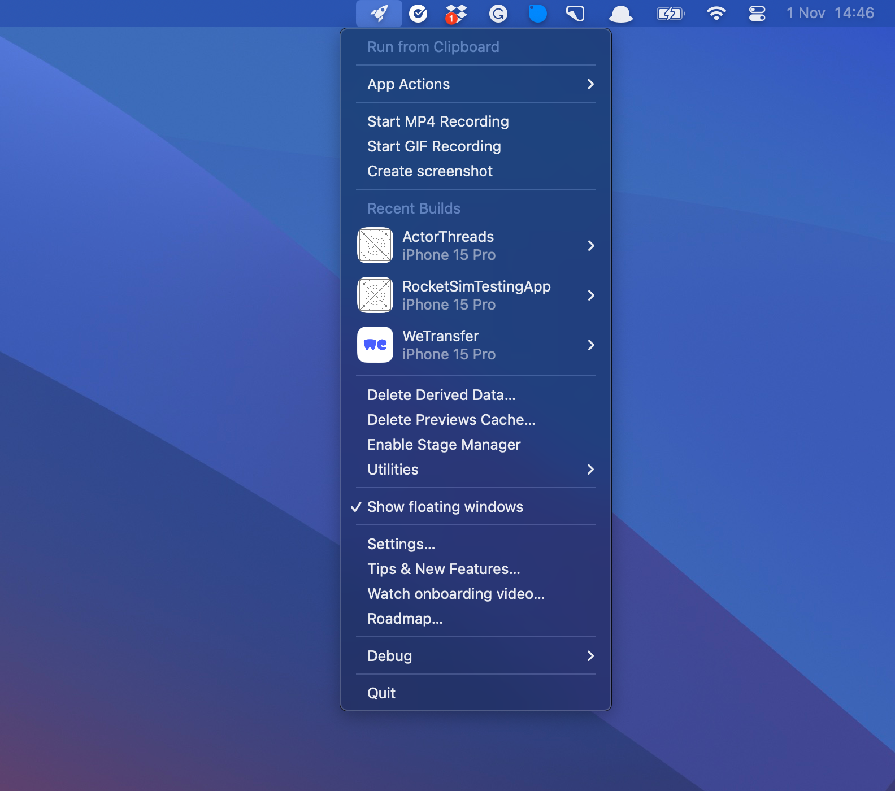
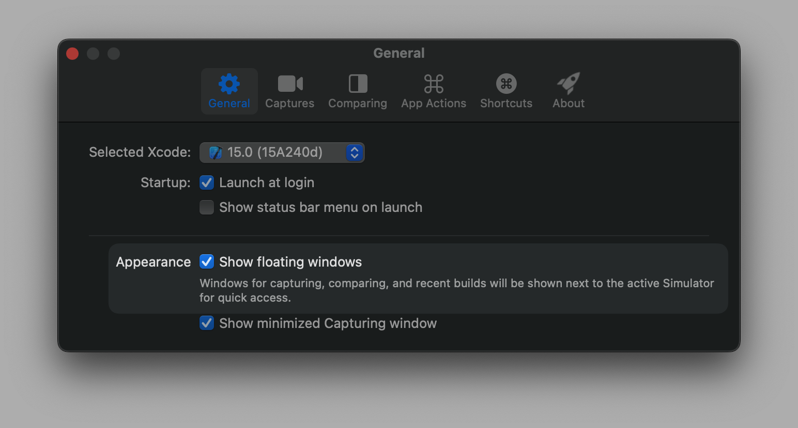

RocketSim's side window is always accessible when you're testing your app in the Simulator. You're in full control of how it appears — reposition it, minimize it, or hide it entirely. Every feature in the side window is also accessible from the menu bar, so the side window is always optional.

## Hiding the Side Window

Using the **more** button (⋯) on the side window:

You can hide the Side Window and move it into a red label:

## Sticky window placement

By default, the side window uses **dynamic** placement (left or right based on available space). You can instead stick it to the **left**, **right**, or **bottom** of the Simulator. Use the more button and select your preference:

## Always show windows

In some cases, you want the side window to never hide. From within the more menu, you can enable this mode:

## Minimized Capturing Window

The captures section is built for new users, explaining each available feature. However, you might enjoy a minimized version:

Which you can enable from the general settings page:

## Always hide the Side Window

The Side Window is not required to access all functionality. When the side window is hidden, you can use RocketSim's **status bar** menu instead:

From the general settings page, you can disable the floating window completely:

