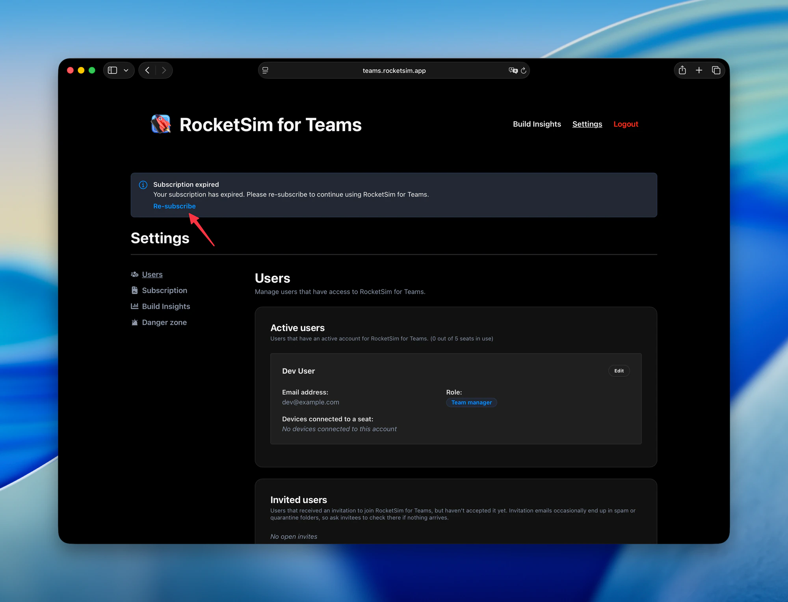
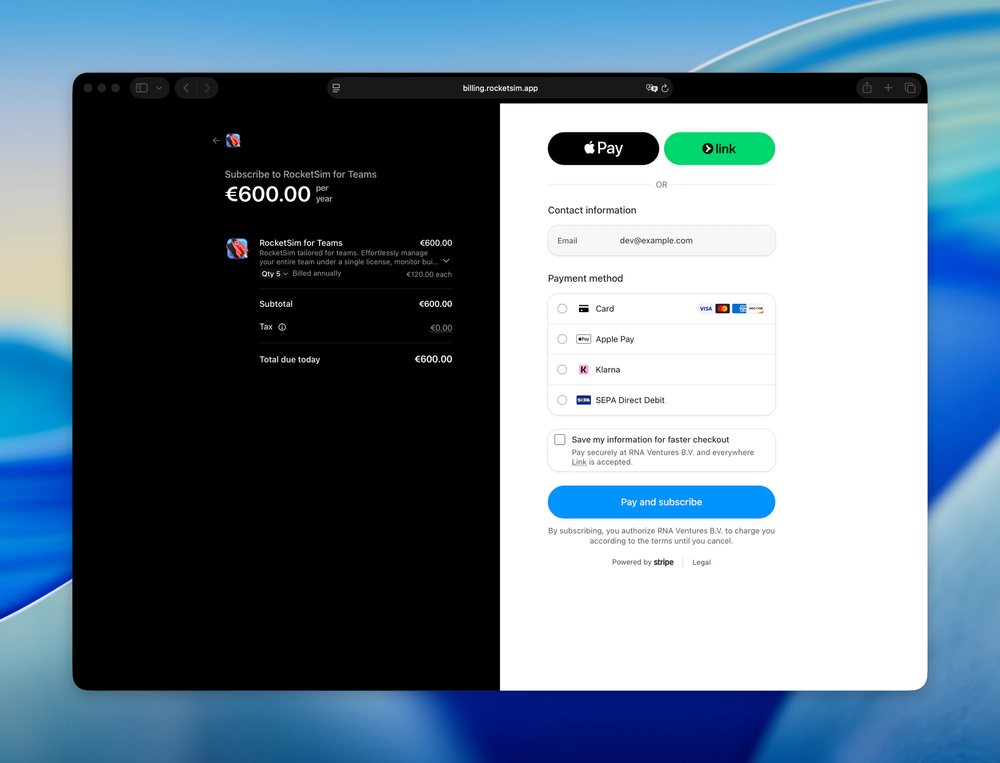
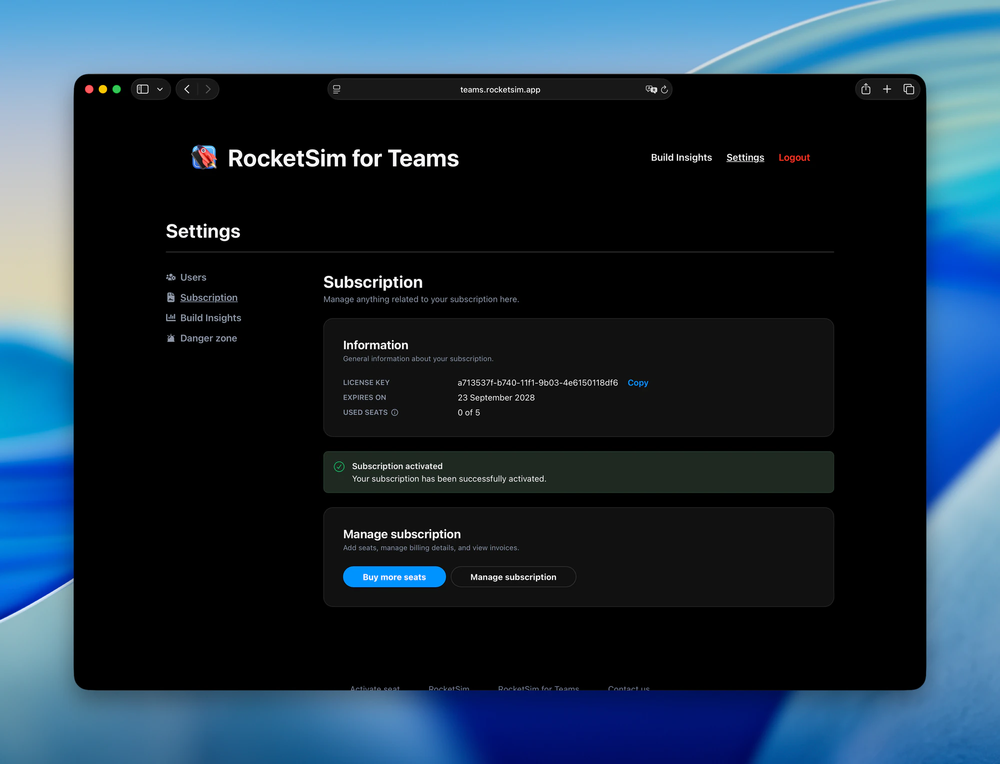
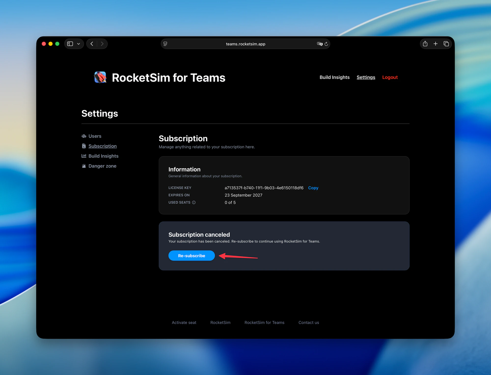
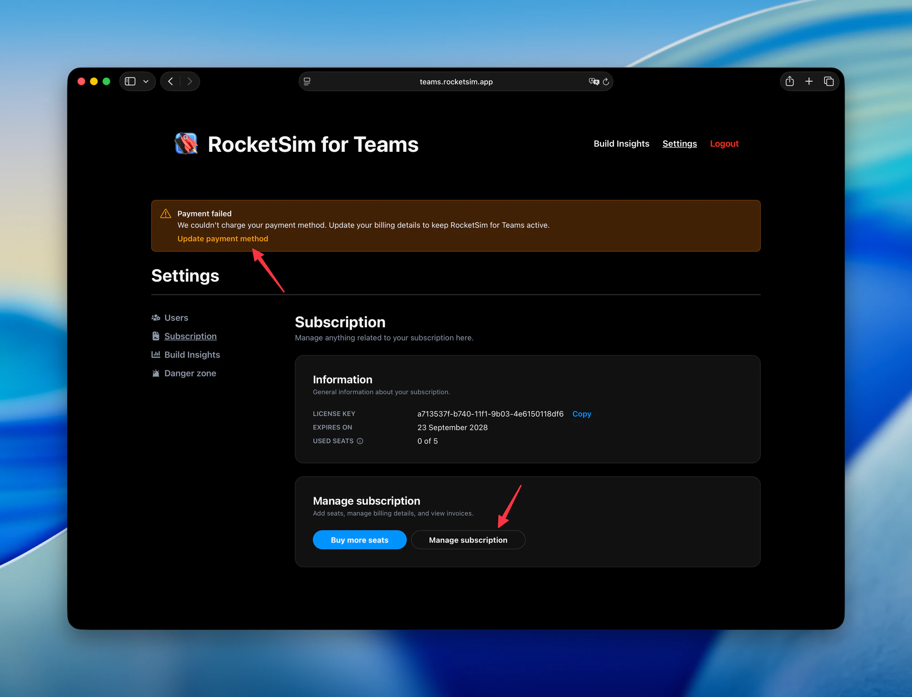

Your RocketSim for Teams subscription is fully self-serve. Renewing an expired license, re-subscribing after canceling, updating a card that failed, adding seats, or grabbing an invoice — you can do all of it yourself from the Teams dashboard in a few clicks.

## Open your subscription settings

1. Sign in at [teams.rocketsim.app](https://teams.rocketsim.app/login) with your team manager account.
2. Go to **Settings → Subscription**.

The **Information** card shows your **License key**, the date your subscription **Expires on**, and how many **Used seats** your team occupies. When something needs your attention, the dashboard shows a banner at the top of every Settings page.

## Renew an expired subscription

When your subscription has expired, you'll see a **Subscription expired** banner. Click **Re-subscribe** to start the renewal.

You'll land on a secure Stripe checkout at `billing.rocketsim.app`. Check the seat quantity — you can change it here — pick a payment method, and click **Pay and subscribe**. The available payment methods depend on your country.

After paying, you're sent back to the dashboard. A **Subscription activated** confirmation appears, and **Expires on** shows your new renewal date.

## Re-subscribe after canceling

If you canceled your subscription, the Subscription page shows a **Subscription canceled** card instead of the regular management options. Your team keeps access until the date shown under **Expires on**. Click **Re-subscribe** to continue, and you'll go through the same checkout as above.

## Fix a failed payment

A **Payment failed** banner means we couldn't charge your payment method — usually because a card expired or was replaced. Click **Update payment method** in the banner, or **Manage subscription** on the Subscription page, to open the billing portal and enter new payment details.

Update your details before the expiry date to keep RocketSim for Teams active without interruption.

## Add seats, update billing details, or download invoices

The **Manage subscription** card on the Subscription page has two buttons:

- **Buy more seats** — add seats when your team grows.
- **Manage subscription** — update your company or billing details, change your payment method, and view or download invoices.

## What happens for your developers

Nothing changes on their side. Your license key stays the same, and seats reactivate automatically once your subscription is active again. Developers don't need to re-enter the license key or activate their seat again.

## Still stuck?

Email [support@rocketsim.app](mailto:support@rocketsim.app) with your team's email address and a short description of what you see, and we'll help you out.
