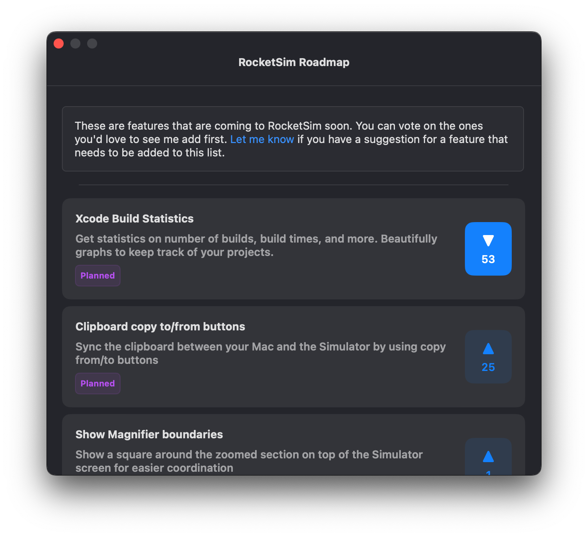

Did you know many of RocketSim’s features today result from user-requested features?

As you’re likely familiar with GitHub, I created a public repository for feature requests: [https://github.com/AvdLee/RocketSimApp/issues](https://github.com/AvdLee/RocketSimApp/issues).

## Public Roadmap

I’m planning ahead any feature development for RocketSim. You can vote on my roadmap to ensure I’m first building the most requested features.

1. Open the Status Bar Menu
2. Select **Roadmap**
3. Submit your votes
    
    
